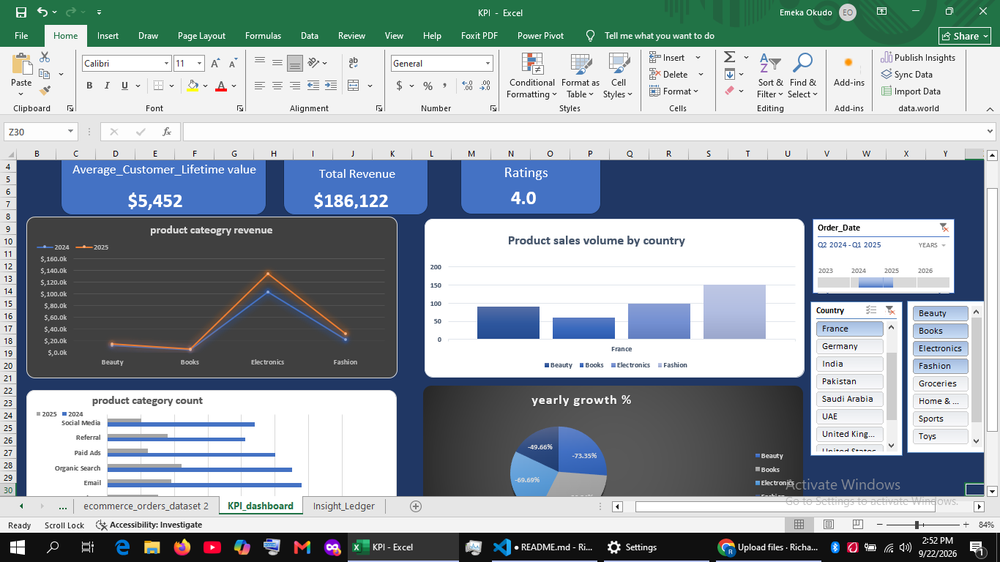
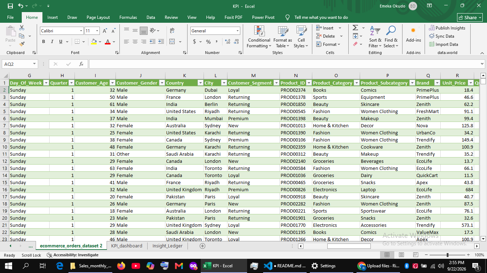

# Ziberal_excel_yearl_performance_dashboard
An interactive dashboard created to analyse profit and business performance for the ficitional retail company of Ziberal

## Project Preview

## Project Overview
Ziberal is fictional retail company company dealing in goods such as toys,books,Electronics,Beauty,
Groceries,Home&kitchen appliances and sport equpiments.

the purpose of the dashboard was to mointor the profit and demand level of each of the mentioned
goods focusing on its sales channel,customser life_time value across different countries of demand and 
overall access the business yearly growth performance across years of sales to better optimize and improve productivity.

## From Data to Dashboard
the project started with obtaining our dataset containing product,unit_price,regions,country,profit margin per item, etc.. from a reliable source **"Kaggle"** to excel, then it was moved to
excel powerquery where a proper preparation and data transformation was performed to clear out certain typo erros and
properly set data type and name for each column in our dataset, afterwards to powerpivot where KPI measures were created
measures such as revenue,Counts,yearly percentage growth and average customser life time value alongside average ratings for
each products across regions.

### Source Data

## Dashboard Features

- Revenue,product sales volume,yearly growth, categorgy count
- regions,& product slicer
- Profit analysis by month,year,channel and customser_life_time value
- Interactive pivotcharts

## Files Included

| File | Description |
|---|---|
| `Dashboard&report.xlsx` | Completed Excel dashboard |
| `Dashboard_screenshot.png` | Preview of the final dashboard |
| `Data.png` | Preview of the source data |
| `README.md` | Project documentation |

## How to Download and Use

1. Download `Dashboard&report.xlsx`.
2. Open the workbook using Microsoft Excel.
3. Navigate to the dashboard worksheet.
4. Use the available filters and slicers to explore the results.

[Download the Excel Dashboard](Dashboard&report.xlsx)

## Tools 

- Microsoft Excel
- Excel formulas
- PivotTables
- PivotCharts
- Dashboard design
- Powerquery
- Chatgpt

